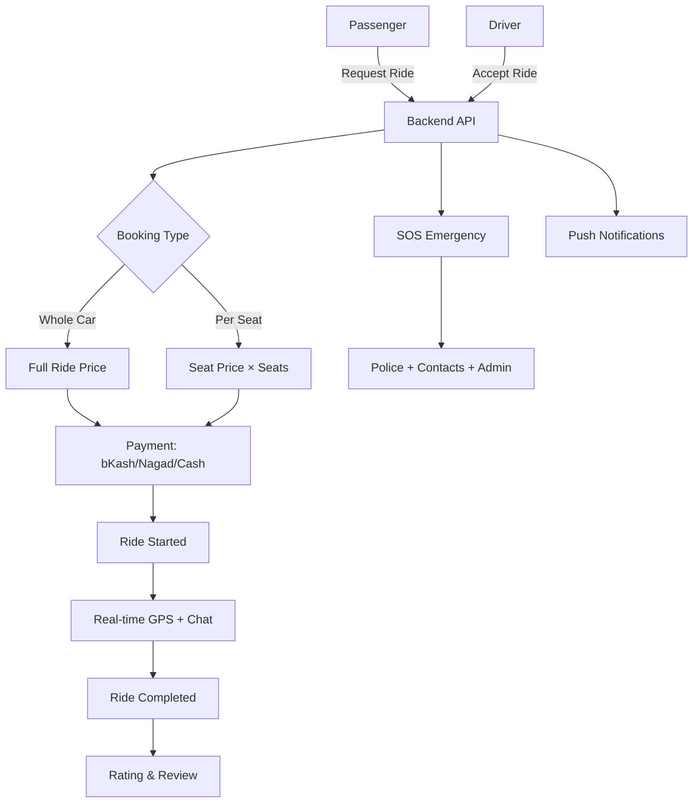
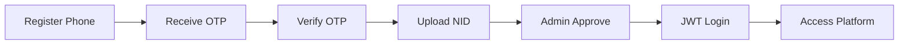
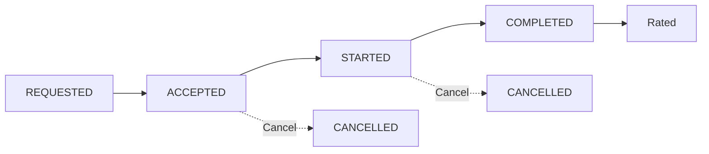

# Implementation Plan — Ride-Share Platform

## System Flow



## Auth Flow



## Ride Lifecycle



---

## Architecture Decisions

| Decision | Choice | Rationale |
|---|---|---|
| **ORM** | Prisma | Type-safe, auto-generated types, easy migrations |
| **Validation** | Zod | Runtime validation + TypeScript type inference |
| **API Response** | `{ success, data, error }` envelope | Consistent frontend parsing |
| **Error Handling** | Custom `AppError` + global middleware | Unified error responses |
| **Logging** | Pino | Fast, structured JSON logs |
| **Auth** | JWT access (15m) + refresh (7d) | Standard stateless auth |
| **Pagination** | Offset-based (page + limit) | Simpler for admin panels |
| **Local Dev** | Docker Compose | One command: Postgres + Redis + App |
| **Testing** | Jest + Supertest | Unit + integration tests |
| **CI** | GitHub Actions | Lint + type-check + test on PR |
| **Real-Time** | Socket.io | GPS tracking, chat, SOS alerts |
| **Notifications** | Firebase Cloud Messaging | Push notifications |

---

## Step 1: Project Scaffold

### 1.1 Initialize Backend
- [x] Create project folder structure
- [x] `npm init -y`
- [x] Install dependencies (Express, Prisma, Zod, Pino, JWT, Socket.io, etc.)
- [x] Setup tsconfig.json (strict mode, bundler resolution)
- [x] Setup folder structure (config, middleware, routes, controllers, services, validators, utils)
- [x] Create `.env.example` with all required vars
- [x] Docker Compose: postgres + redis + app

### 1.2 Database Setup (Prisma)
- [x] Define Prisma schema (9 models: User, Vehicle, Ride, Booking, Payment, EmergencyLog, Rating, Notification)
- [x] Add indexes (phone, rideId, bookingId, etc.)
- [x] `npx prisma generate` — client generated

### 1.3 Redis Setup
- [x] Configure ioredis client
- [x] OTP storage (key: `otp:{phone}`, TTL: 180s)

---

## Step 2: Authentication & Verification

### 2.1 Phone + OTP
- [x] POST `/api/auth/send-otp` — rate-limited (1 per 30s)
- [x] POST `/api/auth/verify-otp` — verify OTP
- [x] Store OTP in Redis with 3min expiry

### 2.2 NID Verification
- [x] POST `/api/auth/register` — creates user with `PENDING` status
- [x] POST `/api/auth/admin/approve-nid` — admin approves/rejects

### 2.3 JWT Authentication
- [x] POST `/api/auth/login` — returns access + refresh tokens
- [x] POST `/api/auth/refresh` — rotate tokens
- [x] Middleware: authenticate + authorize roles
- [x] Block unverified users

---

## Step 3: Vehicle Registration

- [x] POST `/api/vehicles` — register vehicle (driver only)
- [x] GET `/api/vehicles` — list my vehicles
- [x] GET `/api/vehicles/:id` — get vehicle details
- [x] PUT `/api/vehicles/:id` — update vehicle
- [x] DELETE `/api/vehicles/:id` — delete vehicle

---

## Step 4: Ride Management (On-Demand)

### 4.1 Request a Ride
- [x] POST `/api/rides/request` — passenger sends pickup/dropoff + booking type
- [x] Socket.io: emit `ride-request` to all drivers

### 4.2 Accept a Ride
- [x] POST `/api/rides/:id/accept` — driver accepts with vehicle
- [x] Socket.io: emit `ride-accepted` to passenger
- [x] Notification: push to passenger

### 4.3 Booking Type
- [x] WHOLE_CAR — full ride price
- [x] SEAT — price_per_seat × seats
- [x] Validate available seats

### 4.4 Ride Lifecycle
- [x] POST `/api/rides/:id/start` — status → STARTED
- [x] POST `/api/rides/:id/complete` — status → COMPLETED
- [x] Real-time GPS tracking via Socket.io
- [x] GET `/api/rides/my` — list user's rides
- [x] GET `/api/rides/available` — available rides for drivers

---

## Step 5: Payment (Demo)

- [x] POST `/api/payments/initiate` — create payment (BKASH/NAGAD/CASH)
- [x] GET `/api/payments/booking/:bookingId` — get payment status
- [x] Digital methods auto-COMPLETED, Cash PENDING
- [x] Amount calculated from booking type

---

## Step 6: Socket.io Real-Time

- [x] JWT auth on connection
- [x] User rooms (`user:{id}`)
- [x] Ride rooms (`ride:{id}`) for GPS + chat
- [x] `location-update` / `driver-location` events
- [x] `chat-message` with timestamp
- [x] `typing` indicator
- [x] Server emits: ride-request, ride-accepted, ride-started, ride-completed, sos-alert

---

## Step 7: SOS & Safety

- [x] POST `/api/sos/trigger` — trigger SOS with location + ride
- [x] POST `/api/sos/:id/cancel` — cancel/resolve SOS
- [x] GET `/api/sos/my` — my active SOS
- [x] GET `/api/sos/all` — admin view all active SOS
- [x] Socket.io: emit `sos-alert` to admin

---

## Step 8: Ratings & Reviews

- [x] POST `/api/ratings` — rate user (1-5, with comment)
- [x] GET `/api/ratings/user/:userId` — get user ratings + average
- [x] POST `/api/ratings/report` — report a user

---

## Step 9: Admin Dashboard

- [x] GET `/api/admin/dashboard` — platform stats
- [x] GET `/api/admin/users` — list users (paginated, searchable)
- [x] GET `/api/admin/users/:id` — user details
- [x] PUT `/api/admin/users/role` — change user role
- [x] GET `/api/admin/rides` — all rides (filterable by status)
- [x] GET `/api/admin/reports` — user reports

---

## Step 10: Female Safety

- [x] `femaleOnly` flag on ride requests
- [x] Male drivers filtered out of female-only rides
- [x] POST `/api/safety/share-ride` — share ride with emergency contacts
- [x] POST `/api/safety/auto-sos/:rideId` — auto-trigger SOS
- [x] PUT `/api/safety/emergency-contacts` — update contacts

---

## Step 11: Notifications

- [x] Firebase admin SDK setup (optional, best-effort)
- [x] Device token register/unregister
- [x] Push sent on: ride accepted, started, completed
- [x] Notifications stored in DB
- [x] GET `/api/notifications` — list notifications
- [x] POST `/api/notifications/:id/read` — mark as read
- [x] POST `/api/notifications/read-all` — mark all as read

---

## Step 12: Testing & Deployment

### Testing
- [x] Jest + ts-jest + Supertest setup
- [x] Auth tests (OTP, login, register)
- [x] Ride tests (request, accept, start, complete)
- [x] Test helpers (cleanDb, createTestUser, createTestDriver, createTestVehicle)

### Deployment
- [x] Dockerfile (multi-stage, alpine, non-root)
- [x] docker-compose.yml (Postgres + Redis + App)
- [x] GitHub Actions CI (lint, type-check, test with Postgres + Redis containers)

---

## Folder Structure

```
backend/
  src/
    index.ts
    app.ts
    config/        # env, prisma, redis, logger, socket, firebase
    controllers/   # auth, vehicles, rides, payments, sos, ratings, admin, safety, notifications
    docs/          # per-endpoint API summary
    middleware/    # auth, validate, errorHandler, rateLimiter
    routes/        # auth, vehicles, rides, payments, sos, ratings, admin, safety, notifications
    services/      # business logic per domain
    types/         # express.d.ts + shared types
    utils/         # AppError, apiResponse, jwt
    validators/    # Zod schemas per domain
  prisma/
    schema.prisma
  tests/
    auth.test.ts
    rides.test.ts
    helpers.ts
  Dockerfile
  docker-compose.yml
admin/
  src/
    app/           # pages (login, dashboard, users, rides, sos, reports)
    components/    # Sidebar, StatsCard, DataTable, StatusBadge, Modal
    context/       # AuthContext
    lib/           # API client
```
